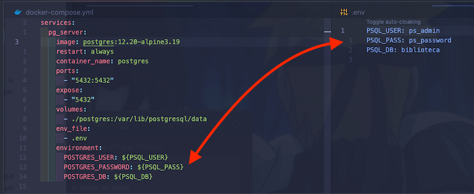
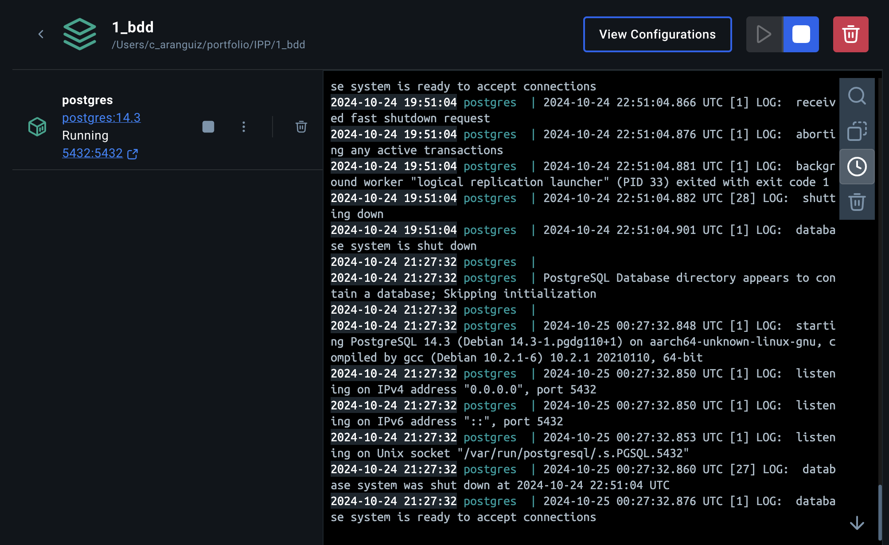
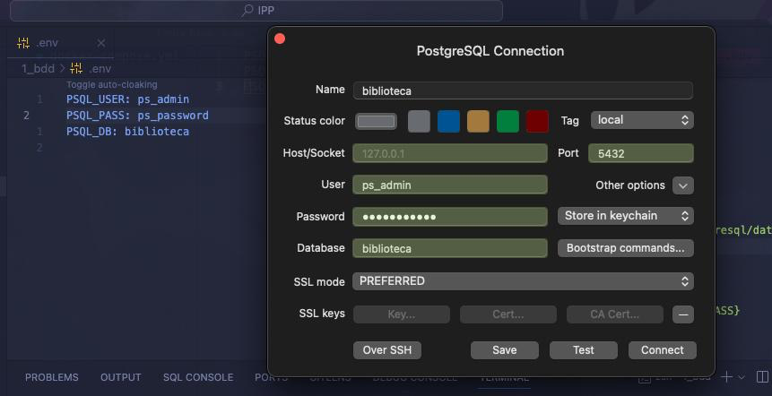
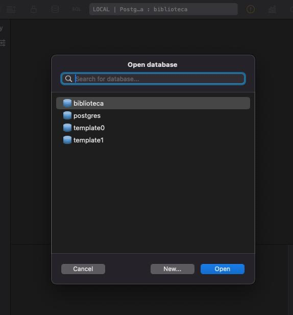
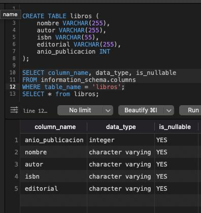

# Bimestre 1 - Bases de Datos

## Caso práctico

### Creación y desarrollo de bases de datos.
Universidad **PULS-AR**

#### Descripción

Click para ver/colapsar <b>descripción</b>

La Universidad PULS-AR requiere de un sistema de información que le permita llevar un control de los libros que se encuentran en su biblioteca. Para ello, se requiere de un sistema que permita registrar los libros, los autores, los lectores y las editoriales. Además, se requiere de un sistema que permita llevar un control de los libros que se prestan a los lectores.

Requisitos:
1. Registrar lectores y libros.
2. Cada lector puede tener más de un libro, pero no el mismo dos veces.
3. De cada libro hay disponibilidad para prestar a cada lector 1 vez.
4. Sobre los libros:
        1. Nombre.
        2. Autor.
        3. ISBN.
        4. Editorial.
        5. Año de publicación.
5. Cuando se ingresa un libro al sistema, se envía un correo a los lectores.
6. Estadísticas de los libros:
        1. Qué libros se han prestado a cada lector.
        2. Libras más prestados en determinadas fechas.
        3. Promedio de edad de los lectores.
        4. La mayor y menor edad de cada lector según libro.

## Actividad Integradora 1: Construcción de una Base de Datos:

Click para ver/colapsar la <b>API 1</b>

### Objetivo:
Realizar el proceso de instalación de un motor de base de datos y la
herramienta de sistema de gestión de base de datos (SGBD) creando un lugar de almacenamiento.

### Instrucciones:
1. Instalar PostgreSQL versión 10 y pgAdmin. (En mi caso utilizaré PostgreSQL 12.20-alpine ya que es la versión simple más antigua soportada por Docker y TablePlus, por ser mucho más ligera en OSX)
2. Crear una base de datos llamada biblioteca, para comenzar con el
desarrollo (hacer una captura del árbol de elementos pgAdmin donde
se visualice la base de datos creada).

### Desarrollo:
1. Se declaran archivo de configuración `docker-compose.yml` para instalar PostgreSQL y archivo de configuración de ambiente `.env` para configurar las variables de entorno, que en este caso, de conexión a la BD:

 - en la captura se pueden apreciar cómo se configura el servicio de PostgreSQL, se le asigna un nombre, se selecciona la imagen de PostgreSQL 12.20-alpine, se le asigna un puerto, se le asigna un volumen para persistir los datos (físicos) y se le asignan credenciales de acceso que se obtienen de las variables de entorno.

2. Se ejecuta el comando `docker-compose up -d` para levantar el contenedor de PostgreSQL (la bandera `-d` es para que se ejecute en segundo plano).

- captura del servidor de PostgreSQL corriendo en Docker.

3. Revisión de la conexión a la base de datos `biblioteca` con TablePlus.

- captura de la conexión exitosa al puerto de PSQL con las credenciales declaradas en archivo de configuración yml, en conjunto del árbol de elementos de la base de datos `biblioteca` en TablePlus.

**extra**: se crea tabla `libros` con los campos solicitados en el caso práctico.

